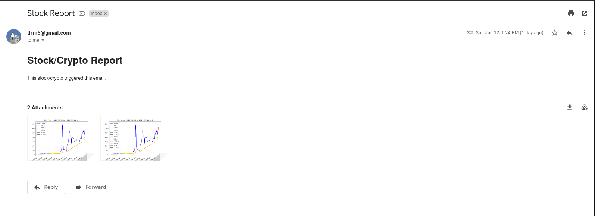
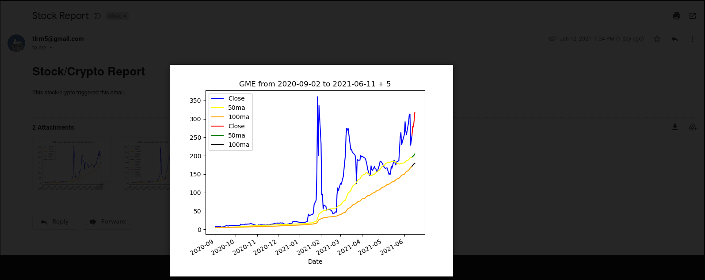
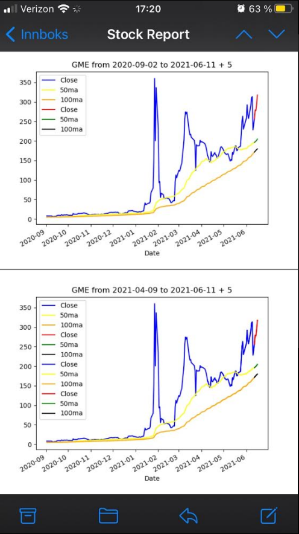

# Purpose
This application emails you a stock of your selection a couple graphs that show where the stock is in relation to its 50 day moving average and it's 100 day moving average every hour during market hours. 

This allows the user to stay a little more out of touch with the markets while still being informed of good times to buy.

# Requirements
1. You need to have Gmail account that allows applications to send emails for you.
    - [Here is a link](https://support.google.com/accounts/answer/6010255?hl=en) to the documentation
1. `cd` inside the `Stock-Report` directory.
    - Then run this command `pip3 install -r requirements.txt`
    - This sets up your environment to be able to run the program.
2. Create a `.env` file in your Data directory with the following variables:
    - `export EMAIL=yourUserName`
    - `export PASSWORD=yourPassword`
    - EMAIL = your Gmail address.
    - Password = your Gmail third party password.
    - There is an example file in that directory called `your-env-here.txt`
3. I would set this program to run automatically via a [cron job](https://phoenixnap.com/kb/set-up-cron-job-linux#:~:text=The%20Cron%20daemon%20is%20a,other%20commands%20to%20run%20automatically.)
    - `crontab -e` then insert `30 8-15 * * 1-5 python ~/path/to/main/file/main.py`

# Process Overview
The process is a rather simple at the moment. It takes in stock information from the yfinace library and processes it to be then fed through an ARIMA model. After which, the forecasted price is then appended to the actual price and is used to calculate the 50 day and 100 day moving averages. Then a basic line graph is created from these predicted values and is emailed to you. For safety reason, the project can read an external config file that should be located in the Data/ directory which contains sensitive user info.

Example of an email you would receive from your desktop.

  

An opened image.

Example of an email received from your phone.

# About the Process
## ARIMA
The ARIMA model takes in closing prices. It trains on 80% of the data and tests on 20% of the data. However, I really only care about the next 5 days it forecasts. In this case, the root mean squared error (RMSE) return only takes that into account. Otherwise, if you asked the model to predict 100 days in the future, it would start to return a horrible result after a while. As a P,Q,D order is required, I created a nested for loop that goes over every option up to (4,2,4) and pick the one with the lowest [AIC (Akaike's Information Criterion)](https://en.wikipedia.org/wiki/Akaike_information_criterion).

## Random Walk
To ensure that the model does better than a Random Walk, I created a random walk and found the RMSE of that too. In the future, I would like to send the user this information so that they can determine the validity of the graph.

## Basic Analysis
After A prediction has been made, new moving averages are determined. In the project, I used the 50 and 100 day moving averages.

A matplotlib graph is then made of this new data frame that contains the predicted Close, 50 MA, and 100 MA is then.

## Email
The email reads the /Data directory which can be found in the projects uppermost directory and then sends the images to that individuals account. The email this project sends is unfortunately lacking. It is hard-coded to only send two images in one email. In the future I hope to update that.

## Our Suggested Strategy For Bear Markets: The Ichimoku Cloud

To build this strategy we use The Technical Analysis Library for Python, ta, and call the data for Tenakan-sen (trend-ichimoku-a) and Kinjun_sen (trend-ichimoku-b) to create the buy/sell signals for the crossover called 'trend_ichimoku':

'trend_ichimoku'= where ('trend_ichimoku_a' > 'trend_ichimoku_b', buy,sell).

We tried this strategy in different time frames ( 5years/daily, 6months/hour and 60days/5min) being the most effective the shortest time frame, as we compared the back test Cumulative Returns of the strategy against the one holding the position for each period, as we show it bellow: 

Example for TSLA:

The Strategy is more recommended to be use in a short time frame (60 days/5 min) where it shows the cumulate returns most of the time is better than holding the position for the same time frame.

In stocks with negative trend, the strategy can mitigate the loss compared to the one holding the position

# Conclusion and Possible Future Additions
This project has a really promising foundation. However, it is not really usable at the moment. Here are some things that I would like to add:

## Crypto Currencies.
- This project has the setup to be able to bring in cryptocurrency information, however, the API I used would not let me pull nearly enough in a day to be able to finish it in the timeframe given.
## Conditional Statements
- If a Stock is around its 50, 100, 200 day moving average, THEN send me an email. Otherwise do nothing.
- If the ARIMA model has a lower RMSE than a Random Walk, then don't send me an email.
    - Or send an email that says such.

## Email
- If I couldn't send an unknown amount of pictures via email, then I could just send a known amount and have a list of the assets to look into instead.

